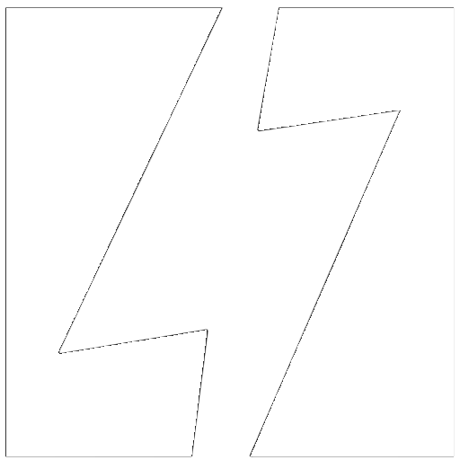

# energizeai/actions

Welcome to `energizeai/actions`, by Energize AI. We're building the foundations for a new AI-centered internet, in which Actions are a core building block. Our agent Spark is designed to run a variety of tasks, such as sending emails via Google, creating issues in Linear, and more. This repository is dedicated to community contributions for developing new actions for Spark. The Actions Development Enviornment (ADE) allows developers to quickly build and test new actions.

## Documentation

To create and submit a new action, please follow [documentation](/packages/registry/DOCUMENTATION.md).

## Contributing

Please read the [contributing guide](/CONTRIBUTING.md).

## License

Licensed under the [MIT license](/LICENSE).
